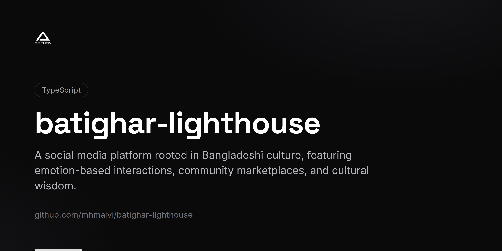
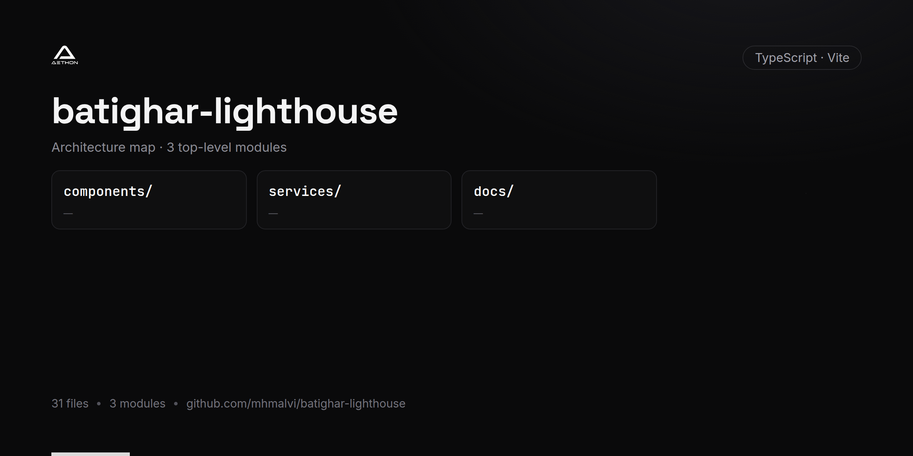

<!-- repo-card -->




# Bātighar (Lighthouse)

A social media platform rooted in Bangladeshi culture, featuring emotion-based
interactions, community marketplaces, and cultural wisdom.

## Tech Stack

- React 19
- TypeScript
- Vite

## Run Locally

**Prerequisites:** Node.js

1. Install dependencies:
   ```
   npm install
   ```
2. Set the `GEMINI_API_KEY` in [.env.local](.env.local) to your API key.
3. Start the dev server:
   ```
   npm run dev
   ```

## Build

```
npm run build
```

Preview the production build with `npm run preview`.
